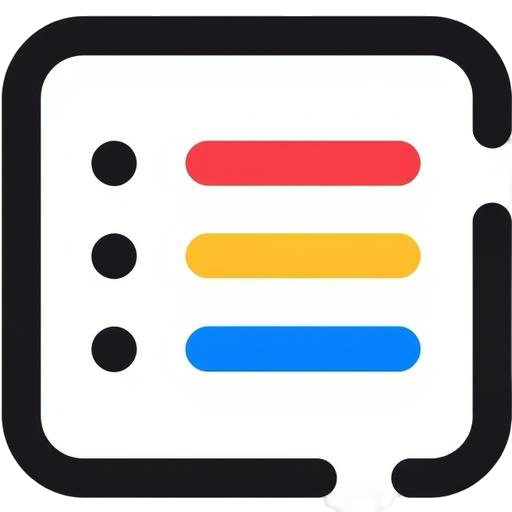
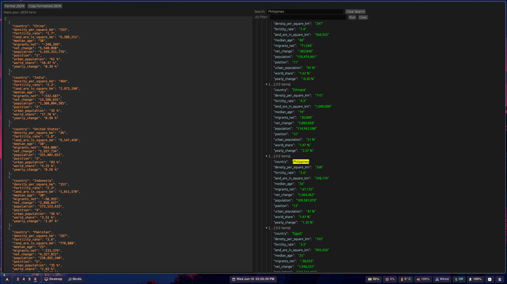
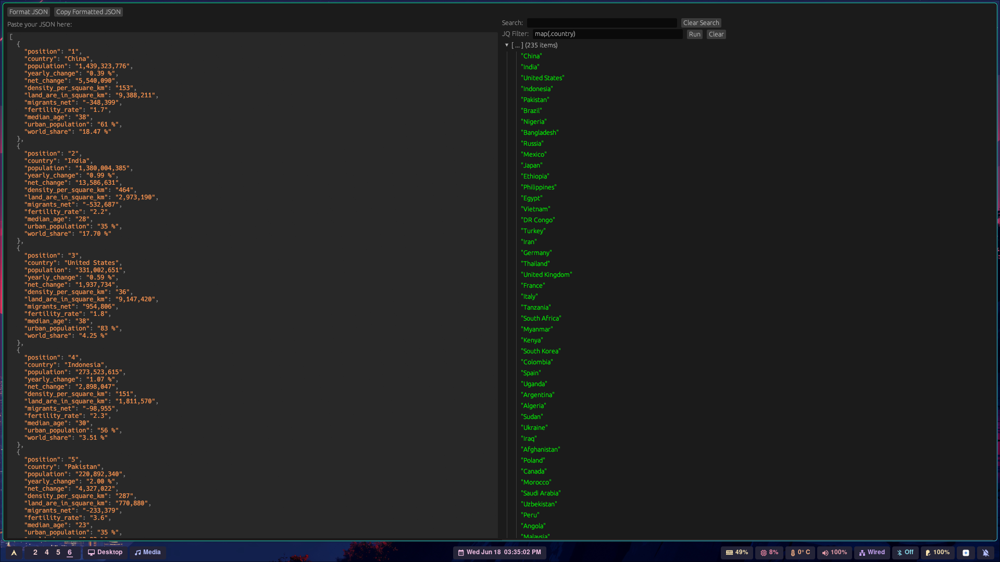

<h1 align="center">JSON Query</h1>

<h3 align="center">
  
</h3>

<div align="center">
  Your ultimate desktop tool for JSON formatting and JQ querying.
</div>

---

## What is JSON Query?

**JSON Query** is a powerful and intuitive cross-platform desktop application built with Rust, designed to streamline your workflow when dealing with JSON data. It offers robust **JSON formatting** and integrates the versatile **JQ** query language, empowering you to quickly transform raw JSON into readable formats and extract precise data with ease.

---

## Features

* **⚡ Blazing Fast JSON Formatting:** Instantly pretty-print minified or unreadable JSON into a clear, hierarchical structure.
* **🔍 Powerful JQ Integration:** Execute complex JQ queries directly within the application to filter, transform, and manipulate your JSON data.

---

## Why Use JSON Query?

* **Boost Your Productivity:** Say goodbye to manual formatting or wrestling with command-line JQ. This tool brings the power to your fingertips.
* **Simplify Complex Data:** Make sense of large and intricate JSON payloads by quickly structuring them and pinpointing the data you need.
* **Secure & Private:** All operations are performed locally on your machine. Your data never leaves your computer.
* **No Dependencies:** No need to install Node.js, Python, or other runtimes. Just download and run!

---

## Screenshots




---

## Installation

* **Arch Linux:** `yay -S json-formatter-gui`

### Build From Source

If you prefer to build the application yourself, you'll need to have the **Rust toolchain** installed. We recommend using `rustup` for managing Rust versions.

1.  **Clone the repository:**
    ```bash
    git clone [https://github.com/your-username/your-repo-name.git](https://github.com/your-username/your-repo-name.git)
    cd your-repo-name
    ```

2.  **Build and run the application:**
    ```bash
    cargo run --release
    ```
    *Note: The `--release` flag compiles with optimizations, resulting in a faster and smaller executable.*

---

## How to Use

1.  **Paste or Load JSON:**
    * Paste your raw JSON text directly into the "Input" area.

2.  **Format JSON:**
    * Click the "Format" button. Your JSON will instantly be pretty-printed in the "Output" area.

3.  **Enter JQ Query:**
    * Type your JQ query into the designated "JQ Query" input field.
    * As you type, the "Output" area will dynamically display the results of your query on the formatted JSON.

---
